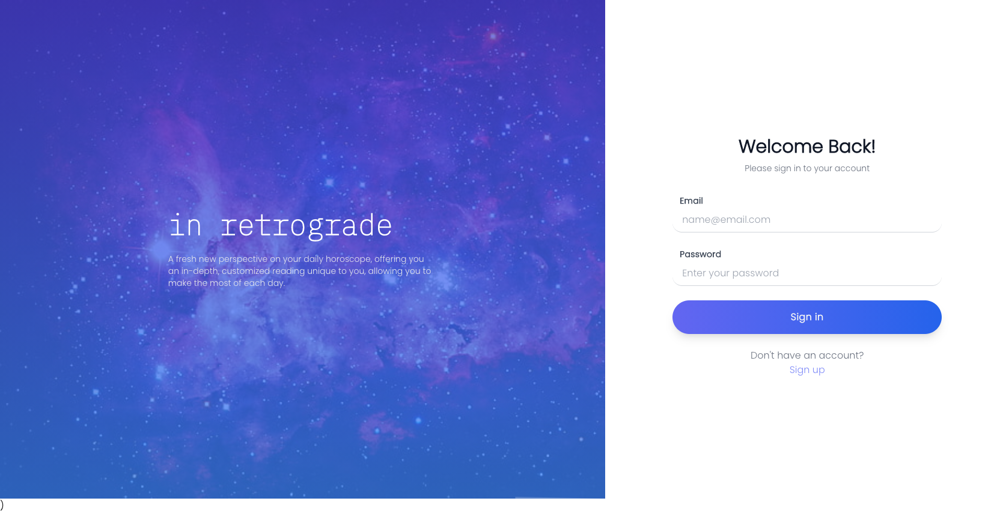
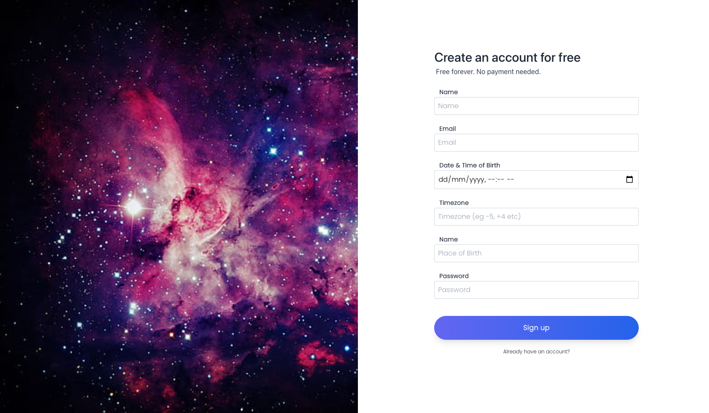
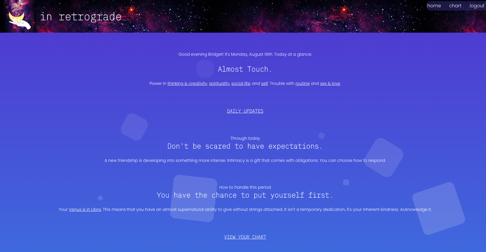
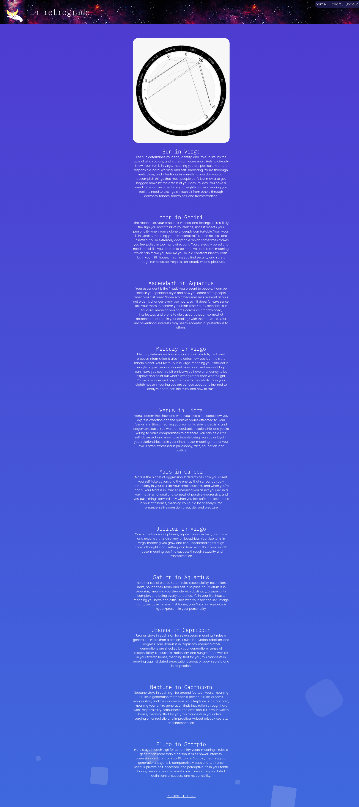

# In-Retrograde

## This GitHub repository contains the code for an astrology website.

---

### This application allows for a user to create a profile and access their astrology information including information on their various signs and forecasts.

---

## Table of Contents

* [Installation and Usage](#installation-and-usage)
  * [Installation](#installation)
  * [Usage](#usage)
* [Motivation and Research](#motivation-and-research)
* [Development](#development)
  * [Web development technologies](#web-development-technologies)
  * [Graphic Design and Branding](#graphic-design-and-branding)
  * [Challenges](#challenges)
  * [Future Development Opportunities](#future-development-opportunities)
* [License](#license)
* [Contributing](#contributing)
* [Questions](#questions)
* [Repository Link:](#repository-link)
* [Deployed Application Link:](#deployed-application-link)
* [Application Screenshots:](#application-screenshots)

---

## Installation and Usage

### Installation

Fork the repository and then run this command within the repo directory:

```npm install```

In the ```package.json``` file, update the ```"homepage"``` with your personal link.

### Usage

A live version of this application is currently hosted at : https://in-retrograde.herokuapp.com

Create an account and sign in to access your personalised astrology readings. The first release of this application is a proof of concept, as such the information currently displayed is hard coded in. Personalised information will be available in version 2.0.

To run this in your local server, first ensure you are running the terminal from the root path of the directory.

Use ```npm run develop``` to start the application on your local server.

Use ```npm run build``` to build this application before deploying to a live site.

---

## Motivation and Research

The motivation behind this project was to create a platform for people to access in depth astrology information without paying a premium. Premium content - freemium price.

When researching the current platforms and methods that many Australians use to get their astrology information. In general, users were confused as to where to get astrology information, often getting a basic horoscope from their internet homepage and were not aware of the depth and detail available in a daily horoscope. Some users who still used print media relied on the basic horoscope information found within their daily newspaper, but this was also often incomplete and not customised to their specific location or time of birth.

When surveying the options currently available within the market it was found that most sites charge a premium for access to detailed and accurate astrology information. Many of the surveyed sites had free options available but they considerably limited the information available to users without requiring a subscription. Some free options were available, however reviews of free to use vs pay to use sites vary dramatically in quality and ease of use. “In Retrograde” is designed to offer premium services at no cost to the end user.

“In Retrograde” is designed to be easy to use, with a singular focus on providing quality horoscope information due to API integration with leading horoscope data providers. It’s singular focus provides a streamlined user experience, and it is not incentivised to monetise its customer base through advertising or sharing of data with third parties.

Many horoscope apps just give information on Sun signs. “In Retrograde” is planned to give a more in depth analysis of horoscopes by determining not only your sun sign, but your moon, ascending and planet in signs and in houses reports. Just some features that “In Retrograde” will offer include life and love forecast reports, love compatibility reports as well as your daily, weekly and monthly forecasts.

---

## Development

### Web development technologies

Development of the project was centered around using React in the frontend and Node in the backend.

React is a free and open-source front-end JavaScript library for building user interfaces or UI components.

Node.js is an open-source, cross-platform, back-end JavaScript runtime environment that runs on the V8 engine and executes JavaScript code outside a web browser.

I implemented the use of CRACO, **C**reate **R**eact **A**pp **C**onfiguration **O**verride, an easy and comprehensible configuration layer for create-react-app, in order to utilise Tailwind CSS to style this application.

Links to some of the languages and tools used to build this project are included below:

* HTML5
* Javascript ES6
* CSS3
* Apollo :
    * https://www.apollographql.com/
* Bcrypt :
    * https://www.npmjs.com/package/bcrypt
* CRACO :
    * https://github.com/gsoft-inc/craco
* Dotenv :
    * https://www.npmjs.com/package/dotenv
* Express :
    * https://expressjs.com/
* Font Awesome Icons
    * https://fontawesome.com/
* Google Fonts :
    * https://fonts.google.com/
* GraphQL :
    * https://graphql.org/
* JSON Web Tokens :
    * https://jwt.io/
* Luxon :
    * https://moment.github.io/luxon/#/
* MongoDB :
    * https://www.mongodb.com/
* Mongoose :
    * https://www.npmjs.com/package/mongoose
* Node.js :
    * https://nodejs.org/
* NPM :
    * https://www.npmjs.com/
* React :
    * https://reactjs.org/
* Tailwind CSS
    * https://tailwindcss.com/

### Graphic Design and Branding

When initially developing the user interface for In Retrograde the application was expected to be primarily accessed from a mobile phone, with the hope that the user would access the application regularly to get their horoscope. A mobile first user interface design was deployed using TailwindCSS, with responsive web design characteristics, allowing the application to scale appropriately to a tablet or desktop web browser.

Keyframe animations were added to provide a pleasing user interface for the user when accessing horoscope information, and provide a high quality graphical experience.

When designing the general look of the application, an effort was made to provide a clean, minimalist and functional interface, with font choices that complimented the application's look.

Future branding opportunities include the addition of an about page to inform the user about myself as the developer, and the goals of the application, and to allow for users to provide donations to continue development. Adding a footer element to the about page that is consistent with my other applications would also further promote myself as a developer and my other projects.

### Challenges

When developing In Retrograde the biggest challenge was finding a suitable API to utilise for the back end horoscope information. A number of API's are available, which range in quality from basic information to quite comprehensive.  A number of enquiries were made to API developers which went unanswered; this was frustrating and heavily contributed to being forced to utilise hardcoded data for the version 1.0 release.

### Future Development Opportunities

Future development opportunities for the application can be focused on both the back end database and the user interface used to run the application.

The first focus point will be centered around the adoption and integration of a suitable horoscope API, allowing for users to view their horoscope information each time the application is accessed. Further customisation of horoscope information returned such as life and love forecast reports, love compatibility reports as well as your daily, weekly and monthly forecasts is also planned, by utilising the API integration previously mentioned.

Other development areas include the ability to add other users to a friends list within the application, with the aim of allowing the user to compare their horoscope compatibility with their friends list, and compare and contrast the differences between the readings for each user.  Social Media integration to allow for users to quickly add their friends on other platforms could also be explored for a later release.

As this was originally a proof of concept application, API integration was not developed for the first release but would be a requirement for a production version of the application.

---

## License

This repository is licensed under the MIT license.

---

## Contributing

No contributions at this time.

---

## Questions

If you have any questions, check out my <a href="https://www.github.com/blmccavanagh">GitHub</a> or email me <a href="mailto:blmccavanagh@gmail.com">here</a>.

---

<div align="center">

**Thank you for visiting.**

</div>

---

### Repository Link:

* https://github.com/blmccavanagh/In-Retrograde

---

### Deployed Application Link:

* https://in-retrograde.herokuapp.com

---

<div align="center">

### Application Screenshots:

*Login Page*



---

*Signup Page*



---

*Homepage*



---

*Chart Page*



---